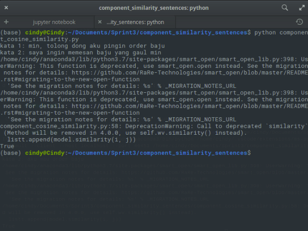
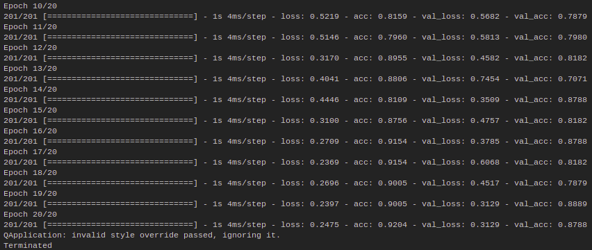
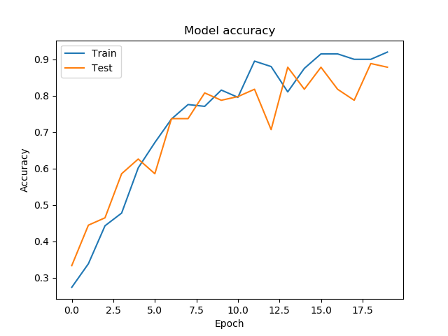
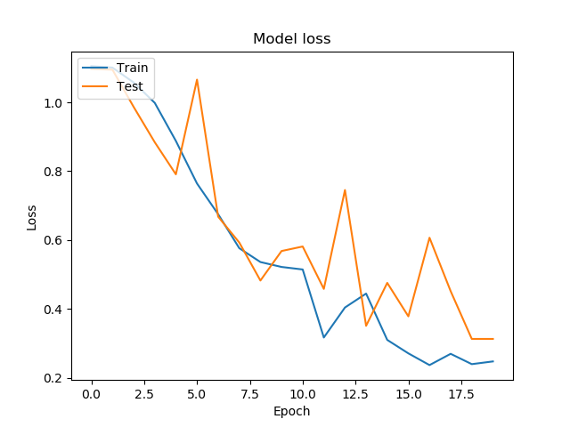
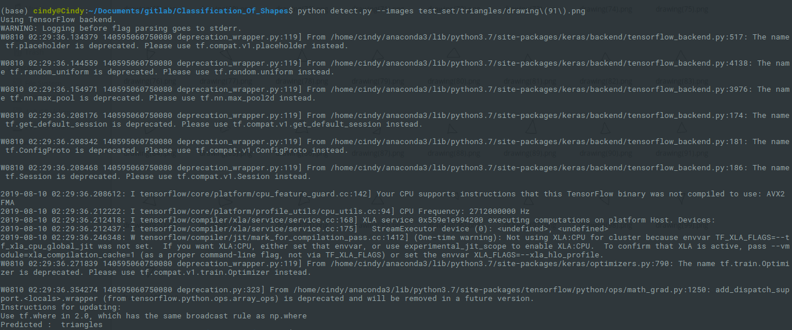
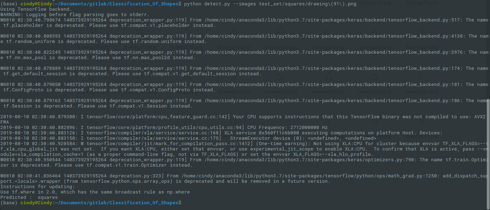
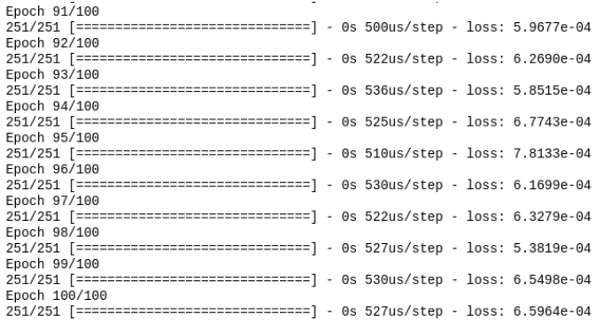
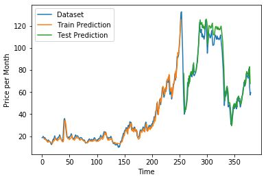
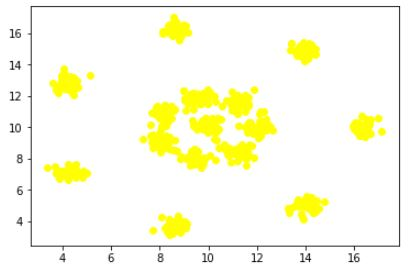

# Portofolio 
## Cindy Alifia Putri

# Detection Sentence Similarity using Word2Vec

Ketika saya melakukan intern di Vutura.io, dimana Vutura.io adalah start-up untuk platform chatbot, saya mengerjakan project untuk mengetes apakah dua buah kalimat akan similar atau tidak. Kedua kalimat dikatakan memiliki kemiripan apabila makna yang terdapat dalam dua kalimat tersebut sama. saya menggunakan cosinus similarity dari Word2Vec dengan model pretrained. Berikut adalah contoh program yang telah saya buat:



Dalam gambar tersebut terlihat bahwa kalimat pertama yang saya buat adalah ‘min, tolong dong aku pingin order baju’ sedangkan kalimat pembandingnya adalah ‘saya ingin memesan baju yang gaul min’ keduanya dinyatakan memiliki kemiripan dengan output yang dikeluarkan adalah True.


# Classification Of Shapes

Link github : github.com/Cindyalifia/Classification_Of_Shapes
Didalam project ini, saya membuat program untuk mengklasifikasikan gambar apakah gambar tersebut akan termasuk kedalam gambar lingkaran, persegi atau segitiga. saya membuat project tersebut kedalam dua program python yang berbeda. 

**File train**  

Ketika saya melakukan training program, hasil akurasi yang saya dapatkan adalah sebagai berikut:  



Akurasi yang saya dapatkan sangat besar mencapai 96%, akan tetapi apabila ingin melakukan pengecilan terhadap hasil akurasi yang didapatkan, maka cukup mengecilkan epoch yang saya gunakan. Hasil model akurasi yang saya dapatkan dari hasil training program tersebut yaitu:   



Hasil model akurasi yang saya dapatkan sangat baik, karena model training yang saya gunakan ternyata benar dibuktikan dengan kurva yang terus naik. Sedangkan untuk model loss yang saya dapatkan adalah seperti berikut:  



**File Predict**
Untuk file predict yang saya gunakan adalah dengan menjalankan:  

```
$ python train.py
```

Untuk file predict yang saya gunakan adalah dengan menjalankan:

```
$ python detect.py --images directory/image.png
```

Dan hasil yang saya dapatkan ketika saya ingin melakukan prediksi terhadap gambar segita, hasilnya adalah sebagai berikut:  



Hasil prediksi yang saya dapatkan sudah benar, dan saya menguji lagi dengan input gambar yang berbeda yaitu square. Dan hasil yang saya dapatkan adalah sebagai berikut:   



Ternyata output yang dihasilkan sudah sesuai dengan hasil yang seharunya didapatkan.

# Crude_Oil_Prediction_Using_ANN

Link github : https://github.com/Cindyalifia/Crude_Oil_Prediction_Using_ANN  

Project ini adalah tentang prediksi harga minyak mentah. Dataset yang saya gunakan adalah dataset dengan rentang waktu 1 bulan. Algoritma yang saya gunakan adalah algoritma ANN berikut adalah hasil running programnya :



Epoch yang saya pakai adalah sebanyak 100 epoch, dan RMSE yang saya dapatkan untuk training adalah sebesar 2.96 sedangkan RMSE untuk testing adalah sebesar 8.01. Dapat dikatakan bahwa hasil loss yang saya dapatkan cukup kecil. Berikut adalah hasil visualisasi data yang saya dapatkan ketika melakukan training adalah sebagai berikut:




# Self_Organizing_Map

Link github : https://github.com/Cindyalifia/Self_Organizing_Map  

Project ini membahas tentang cluster dataset, dimana dataset yang saya punya adalah dataset 2D yang mana memiliki nilai x dan y. Apabila dataset tersebut saya visualisasikan, maka gambar yang dihasilkan adalah sebagai berikut :



Saya melakukan pelabelan terhadap data tersebut, dengan menggunakan algoritma SOM yang diharapkan, data tersebut akan dikelompokkan menurut jarak antar titik. Ketika saya selesai melakukan training, didapatkan hasil algoritma hasil cluster data seperti berikut :


Terlihat bahwa terdapat centroid disetiap cluster, maka untuk setiap cluster tersebut dapat dikatakan bahwa jumlah class hasil cluster data berjumlah 15 class.